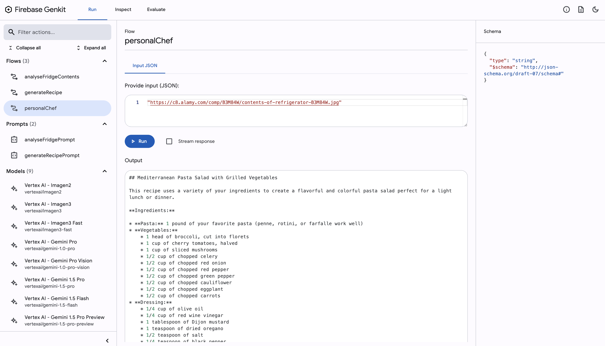

# Genkit Recipe Sample

## Basic user journey

1. User:  Takes picture of fridge
1. User:  Tells app what meal to make (eg breakfast, lunch, dinner, dessert) + genre of food (eg italian, korean, junk food)
1. App:  Displays a recipe + images of major stages of recipe
1. App:  Identifies missing ingredients and orders them for you

## How to run the app

1. Check out the repo
1. `npm install`
1. `genkit start`
1. Open the browser at http://localhost:4000/run/%252Fflow%252FpersonalChef
1. Find a URL to a picture that shows the contents of a fridge. Here is one https://c8.alamy.com/comp/B3M84W/contents-of-refrigerator-B3M84W.jpg
1. Paste the URL into the input field and run the flow

